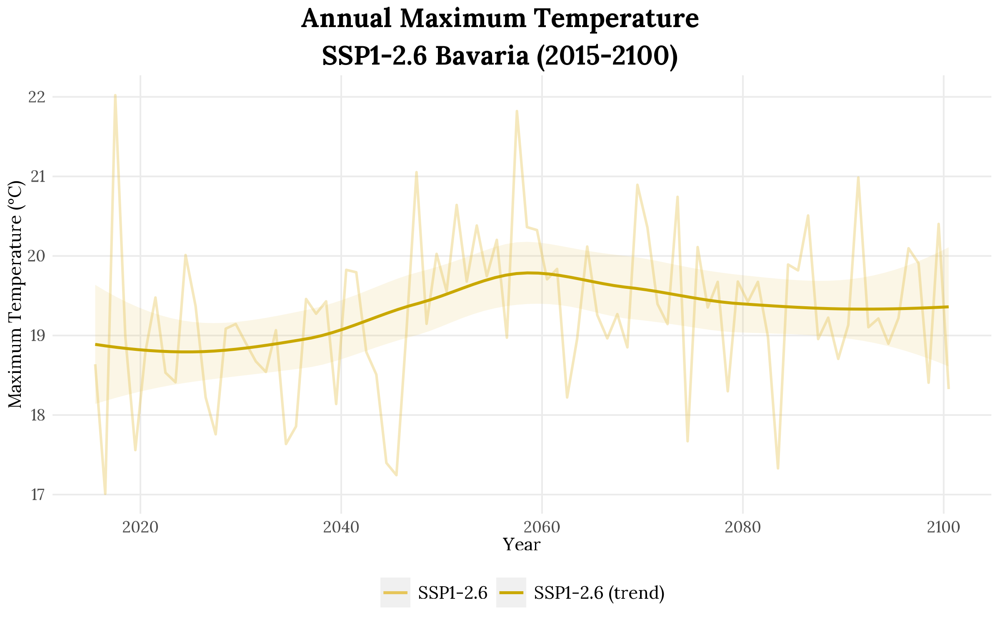
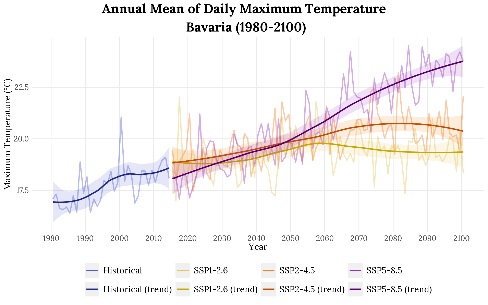
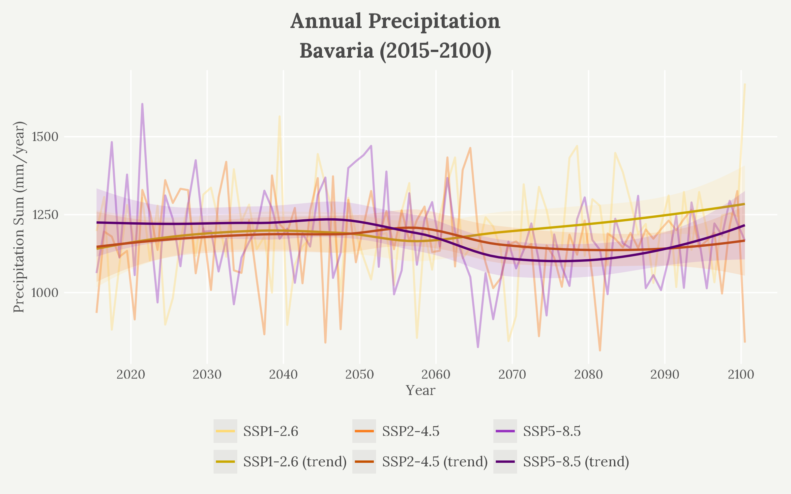

# cmip6r 
 
<!-- badges: start -->
[](https://lifecycle.r-lib.org/articles/stages.html#experimental)
<!-- badges: end -->
 
> Download, process, and visualize CMIP6 climate scenario data from the [Copernicus Climate Data Store (CDS)](https://cds.climate.copernicus.eu) with publication-ready plots. 
 
## Overview
 
`cmip6r` works on two levels:

**Download any CMIP6 variable** — `get_cmip6_data()` works with all scenarios, models, and variables
available on the CDS (temperature, precipitation, humidity, wind, and more), on a global scale or
with a custom bounding box. Downloading via R is faster and more reproducible than using the CDS
website manually. We recommend checking variable and model availability on the
[CDS website](https://cds.climate.copernicus.eu/datasets/projections-cmip6?tab=download) before
downloading, as not all combinations of model, scenario, and variable are available.

**Ready-made plots for key variables** — `plot_timeseries()` provides automatic unit conversion
and visualization for the four most common variables for climate scenario plotting. For other
variables, the downloaded NetCDF file can be read with `read_cmip6()` and plotted manually with
any R package (e.g. `ggplot2`, `terra`).

| Variable | Description | Unit |
|----------|-------------|------|
| `"tas"`    | Mean near-surface air temperature | °C |
| `"tasmax"` | Maximum near-surface air temperature | °C |
| `"tasmin"` | Minimum near-surface air temperature | °C |
| `"pr"`     | Precipitation | mm/month // mm/year |
 
## Installation
  
```r
# Install cmip6r from GitHub
# install.packages("remotes")
remotes::install_github("nicolaheld24/cmip6r")
```

## Dependencies
 
- **`ggplot2`** – visualization
- **`dplyr`** – data manipulation
- **`ncdf4`** – NetCDF file handling
- **`reticulate`** – Python integration (the `cdsapi` Python package is 
  installed automatically on first use via `reticulate::py_install()`)
- **`showtext`**, **`sysfonts`** – enhanced fonts for plots
- **`scales`** – axis formatting

---
## One-time CDS API Setup (required before first use)
 
`cmip6r` downloads data from the **Copernicus Climate Data Store (CDS)** via Python. 
 
### 1. Create a CDS account
 
Register for free at [cds.climate.copernicus.eu](https://cds.climate.copernicus.eu) to get access to your API key.
 
### 2. Find your API key
 
After logging in, go to your **profile page** (top right → your username). The URL and your personal **API key** are displayed there.
 
### 3. Create the `.cdsapirc` file
 
The CDS API looks for a hidden config file in your home directory. Create it like this:
 
**On Windows**:
1. Open Notepad
2. Paste the following content:
```
url: https://cds.climate.copernicus.eu/api
key: YOUR-API-KEY
```
3. Go to **File → Save As**
4. Navigate to `C:\Users\YOURNAME\`
5. Set **"Save as type"** to **"All Files (*.*)"** — this is important, otherwise Windows saves it as `.cdsapirc.txt` which won't work
6. Name the file exactly `.cdsapirc` (with the dot at the beginning, no extension)
7. Click Save

To verify the file was created correctly, run in R:
```r
file.exists(file.path(Sys.getenv("HOME"), ".cdsapirc"))  # should return TRUE
Sys.getenv("HOME")  # shows where R is looking for the file
```

If it returns `FALSE`, the file is either named `.cdsapirc.txt` or saved in the wrong location.
 
**On macOS/Linux** — run in the terminal:
 
```bash
echo "url: https://cds.climate.copernicus.eu/api
key: YOUR-API-KEY" > ~/.cdsapirc
```
 
> Replace `YOUR-API-KEY` with the key from your CDS profile page.
 
### 4. Accept dataset licence
 
Before downloading CMIP6 data for the first time, you need to accept the licence on the CDS website:
 
1. Go to: [CMIP6 dataset page](https://cds.climate.copernicus.eu/datasets/projections-cmip6?tab=download)
2. Scroll down to **"Terms of use"** and click **Accept**
 
---
## Quick Start
 
```r
library(cmip6r)
library(ggplot2) # only needed for additional plot customization

# 1. Set data directory
set_cmip6_dir("my_path/data")
 
# 2. Download monthly maximum temperature for Bavaria
result_126 <- get_cmip6_data(
  variable            = "tasmax",
  model               = "AWI-CM-1-1-MR",
  scenario            = "ssp126",
  start_year          = 2015,
  end_year            = 2100,
  months              = 1:12,
  region              = c(9, 14, 47, 51),  # bounding box of Bavaria: lon_min, lon_max, lat_min, lat_max
  temporal_resolution = "monthly"
)

# 3. Read the downloaded NetCDF file into R
df_126 <- read_cmip6(result_126$file)
# df_126 <- read_cmip6("path_to_nc_file") # in case $file does not work 

# 4. Plot the time series
p <- plot_timeseries(
  df_126,
  title = "Annual Maximum Temperature\nSSP1-2.6 Bavaria (2015-2100)",
)

# Preview in RStudio
p + theme_cmip6(preview = TRUE)

# 5. Save your plot 
ggsave("my_path/max_temp_bavaria_ssp126_2015_2100.png",
       plot = df_126_plot,
       width = 8,
       height = 5,
       dpi = 300)
```





---

## Compare Multiple Scenarios

Download and compare multiple SSP scenarios in a single plot:

```r
# Download historical + three SSP scenarios
hist_tasmax   <- get_cmip6_data(variable = "tasmax", model = "AWI-CM-1-1-MR",
                          scenario = "historical", start_year = 1980, end_year = 2014,
                          months = 1:12, region = c(9, 14, 47, 51),
                          temporal_resolution = "monthly")

ssp126_tasmax <- get_cmip6_data(variable = "tasmax", model = "AWI-CM-1-1-MR",
                          scenario = "ssp126", start_year = 2015, end_year = 2100,
                          months = 1:12, region = c(9, 14, 47, 51),
                          temporal_resolution = "monthly")

ssp245_tasmax <- get_cmip6_data(variable = "tasmax", model = "AWI-CM-1-1-MR",
                          scenario = "ssp245", start_year = 2015, end_year = 2100,
                          months = 1:12, region = c(9, 14, 47, 51),
                          temporal_resolution = "monthly")

ssp585_tasmax <- get_cmip6_data(variable = "tasmax", model = "AWI-CM-1-1-MR",
                          scenario = "ssp585", start_year = 2015, end_year = 2100,
                          months = 1:12, region = c(9, 14, 47, 51),
                          temporal_resolution = "monthly")

# Read files
df_hist_tasmax   <- read_cmip6(hist_tasmax$file)
df_ssp126_tasmax <- read_cmip6(ssp126_tasmax$file)
df_ssp245_tasmax <- read_cmip6(ssp245_tasmax$file)
df_ssp585_tasmax <- read_cmip6(ssp585_tasmax$file)

# Plot all scenarios together
p <- plot_timeseries(
  df_hist_tasmax, df_ssp126_tasmax, df_ssp245_tasmax, df_ssp585_tasmax,
  title = "Annual Mean of Daily Maximum Temperature\nBavaria (1980-2100)"
)

# Customize x-axis breaks
p + scale_x_date(
  breaks = seq(as.Date("1980-01-01"), as.Date("2100-01-01"), by = "10 years"),
  labels = scales::label_date("%Y")
)
```


---

## Precipitation Example

```r
# Read data 
df_hist_pr   <- read_cmip6(hist_pr$file)
df_ssp126_pr <- read_cmip6(ssp126_pr$file)
df_ssp245_pr <- read_cmip6(ssp245_pr$file)
df_ssp585_pr <- read_cmip6(ssp585_pr$file)

# Plot with light theme and reduced line transparency
p_precip <- plot_timeseries(
  df_hist_pr, df_ssp126_pr, df_ssp245_pr, df_ssp585_pr,
  title = "Annual Precipitation\nBavaria (1980-2100)",
  theme = "light",    # use light theme (warm off-white background)
  line_alpha = 0.3    # reduce transparency of raw data lines (default: 0.4)
)

# Customize x-axis breaks
p_precip <- p_precip + scale_x_date(
  breaks = seq(as.Date("1980-01-01"), as.Date("2100-01-01"), by = "10 years"),
  labels = scales::label_date("%Y")
)

# Save
ggsave("my_path/annual_precipitation_bavaria.png",
       plot = p_precip,
       width = 8,
       height = 5,
       dpi = 300)
```


---

## Plot Options

`plot_timeseries()` offers several customization options:

```r
plot_timeseries(
  aggregation      = "mean",    # "mean", "max", "min", "median"
  time_aggregation = "annual",  # "auto", "annual", "monthly", "none"
  show_smooth      = TRUE,      # LOESS trend line
  show_ci          = TRUE,      # 95% confidence band
  theme            = "light",   # "default" or "light"
  line_alpha       = 0.4        # transparency of raw data lines (0-1)
)
```

### Time aggregation behavior

When `time_aggregation = "auto"`, the function automatically selects the aggregation level:

- **> 20 years** → annual aggregation
- **2–20 years** → monthly aggregation
- **< 2 years** → no aggregation

### Themes

Two built-in themes are available:

```r
# Default theme
p + theme_cmip6()

# Light theme (warm off-white background with white gridlines)
p + theme_cmip6_light()

# Preview mode for RStudio (smaller fonts)
p + theme_cmip6(preview = TRUE)
```

---

## Saving Plots

```r

ggsave("my_path/my_plot.png", plot = p, width = 8, height = 5, dpi = 300)

```

---

## Available Scenarios, Variables & Models

Use `cmip6_info()` to display all available options:

```r
cmip6_info()            # show everything
cmip6_info("variables") # show available variables
cmip6_info("scenarios") # show available scenarios
cmip6_info("models")    # show available models
cmip6_info("example")   # show a usage example
```

### SSP Scenarios

| Scenario       | Description                              |
|----------------|------------------------------------------|
| `"historical"` | Historical simulation (1850–2014)        |
| `"ssp126"`     | Low emissions – sustainable development  |
| `"ssp245"`     | Intermediate emissions – middle of road  |
| `"ssp370"`     | High emissions – regional rivalry        |
| `"ssp585"`     | Very high emissions – fossil-fuelled     |

### Common Variables

| Variable    | Description                        |
|-------------|------------------------------------|
| `"tas"`     | Near-surface air temperature       |
| `"tasmax"`  | Daily maximum temperature          |
| `"tasmin"`  | Daily minimum temperature          |
| `"pr"`      | Precipitation                      |
| `"hurs"`    | Near-surface relative humidity     |
| `"sfcWind"` | Near-surface wind speed            |
| `"rsds"`    | Surface downwelling shortwave radiation |

### Supported Models

`cmip6r` supports 57 CMIP6 models including `AWI-CM-1-1-MR`, `CanESM5`, `CESM2`,
`MPI-ESM1-2-LR`, `EC-Earth3`, and more. Run `cmip6_info("models")` for the full list.

---

## Function Reference

| Function            | Description                                  |
|---------------------|----------------------------------------------|
| `set_cmip6_dir()`   | Set the directory for downloaded data        |
| `get_cmip6_data()`  | Download CMIP6 data from CDS                 |
| `read_cmip6()`      | Read a `.nc` file into a data frame          |
| `plot_timeseries()` | Plot a time series for one or more scenarios |
| `cmip6_info()`      | Display available variables, scenarios, models |
| `theme_cmip6()`     | Default ggplot2 theme                        |
| `theme_cmip6_light()` | Light ggplot2 theme                        |

---

## Citation
 
If you use `cmip6r` in your research, please cite:
 
```
Held, N. (2026). cmip6r: Download and Visualize CMIP6 Climate Scenario Data.
R package version 0.1.0. https://github.com/nicolaheld24/cmip6r
``` 
---
 
## License
 
MIT © Nicola Held
